# Issue #81 visual and QA evidence

## Immutable anchors

- Baseline: `origin/main` at `81a5dfe812e37a78110311a0277a79bb0a920913`.
- Pre-#80 comparison: `4b3558ca8dd4443470df43b81bfce61a7ea523d1`.
- Final implementation anchor: `bc0e016cfcb3d187b7fef8cc2bf8b30ce0066563`.
- Machine-readable capture and Lighthouse provenance: [`qa-manifest.json`](qa-manifest.json).
- The evidence package records the executable source head above; the final branch head is the evidence-only commit after it and is reported with the PR head. No merge was performed.

## Capture method

所有影像都是 1x PNG，使用獨立 Chromium context、固定 viewport、`document.fonts.ready`、viewport 內圖片完成後擷取；capture 前將 `scrollBehavior` 設為 `auto`。Before 與 after 使用不同的 production preview artifact，並以 `--strictPort` 固定埠：

- before：detached baseline worktree，`http://127.0.0.1:4183/`
- after：final branch，`http://127.0.0.1:4182/`

每個 context 都驗證頁面 title 與 header brand 為 `Business Japanese Hub`，避免 port collision 把其他產品頁面當成 Library 證據。

### 1440 × 900

| surface | before | after |
| --- | --- | --- |
| light top | 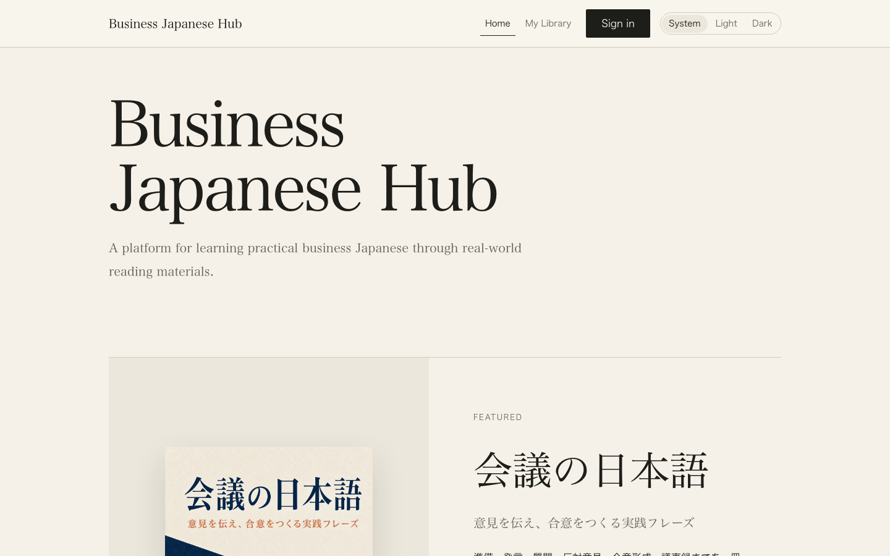 |  |
| dark top |  | 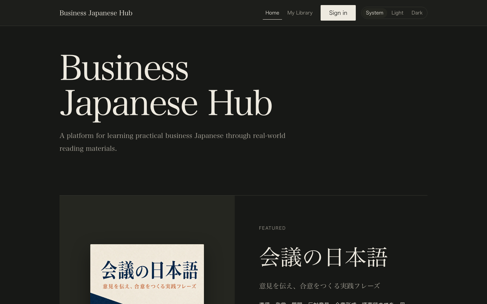 |
| light closing / footer | 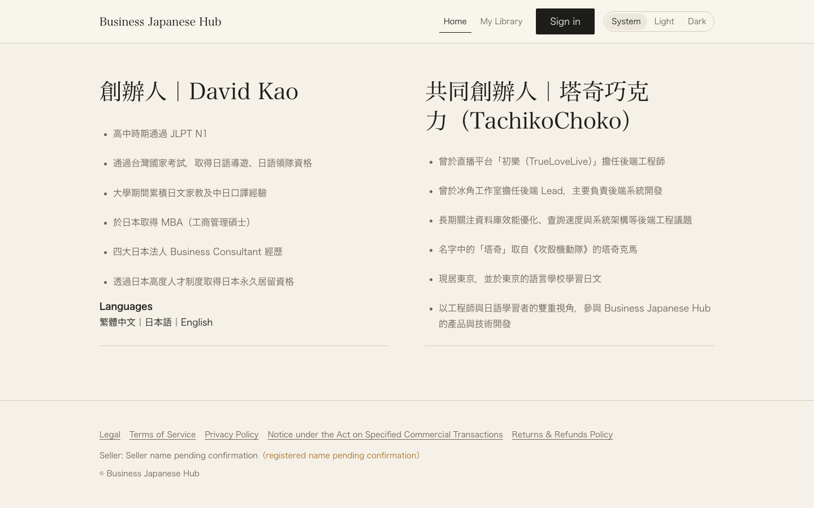 | 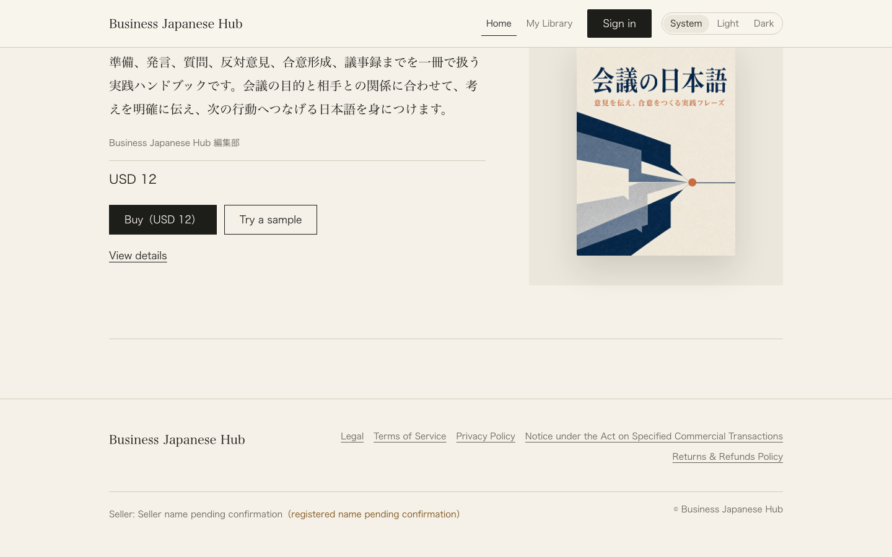 |
| dark closing / footer | 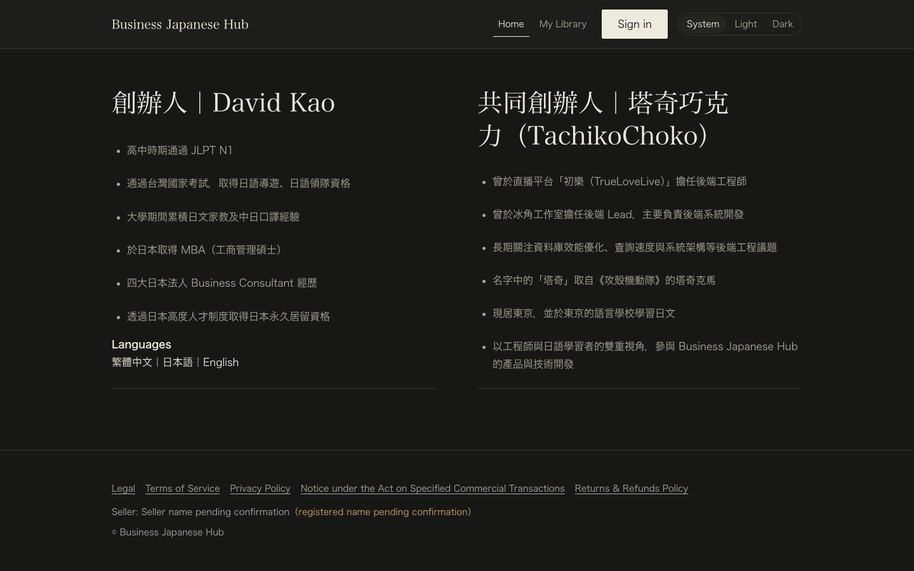 | 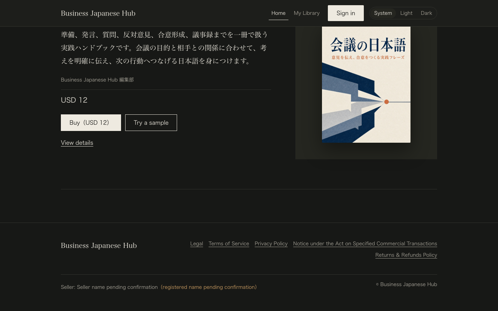 |

### 390 × 844

| surface | before | after |
| --- | --- | --- |
| light top | 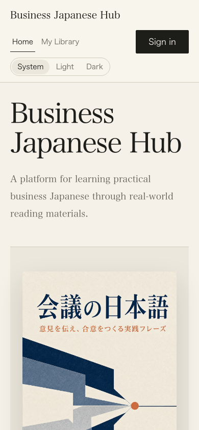 | 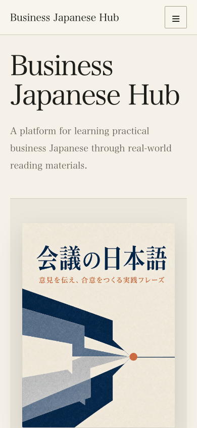 |
| dark top | 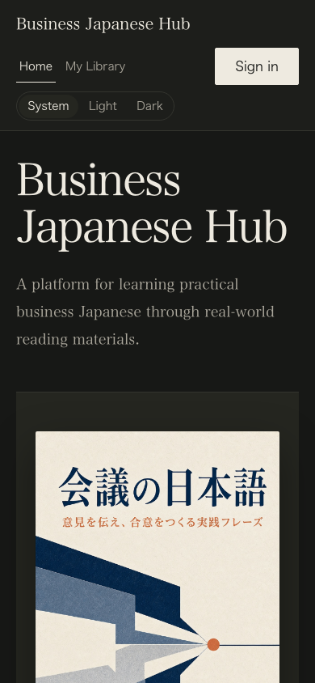 | 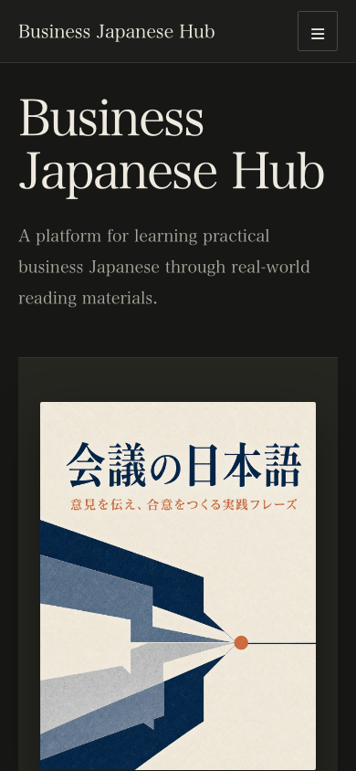 |
| light closing / footer | 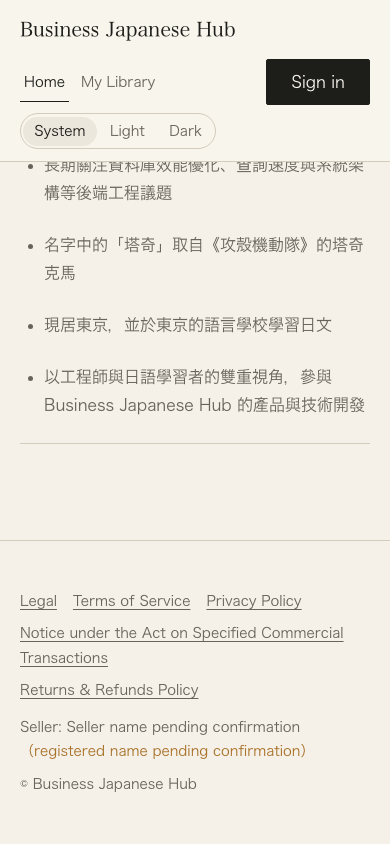 | 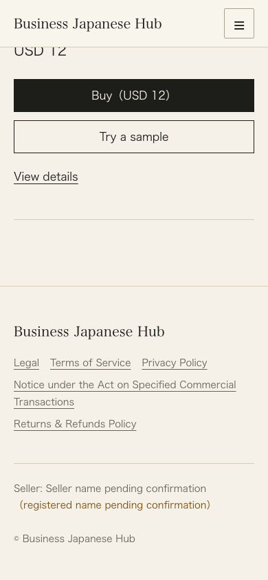 |
| dark closing / footer | 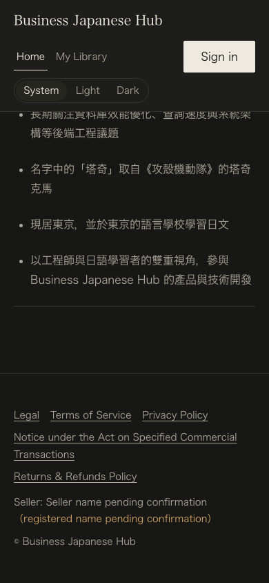 | 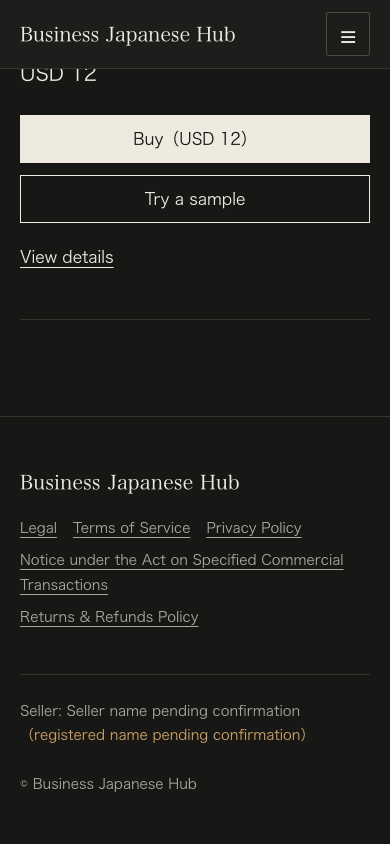 |
| mobile menu, light | — | 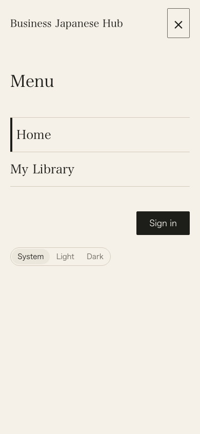 |
| mobile menu, dark | — | 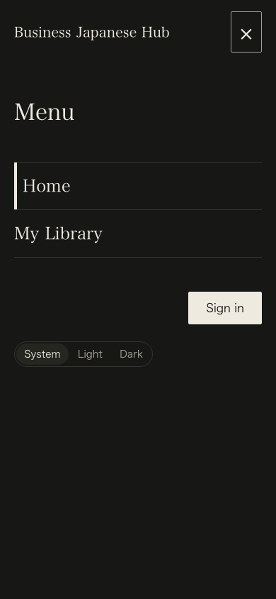 |

## Product and interaction QA

- Final CTA is one generic catalog projection: the first released Book whose declared price tier is `paid`; it reuses `Price`, `BookActions`, ownership/reading state, preview boundary, cover, and the provider-neutral purchase seam. No slug, amount, plan, subscription, tier, discount, bundle, badge, or payment logic was added.
- Mobile navigation keeps the existing Home / My Library IA and makes the existing Account / Appearance controls available inside the same overlay. The overlay uses the theme background token, visible close control, `role="dialog"`, `aria-modal`, focus entry, Tab / Shift+Tab containment, Escape, focus return, route-close behavior, body scroll lock, and background pointer blocking through the full-viewport surface.
- The native radio-group Tab stop is treated as a single checked control by the trap. The desktop control row begins at 800px; 390px, 768px, and 799px use the menu surface, while 800px, 1024px, 1280px, and 1440px use the fitting desktop row. All checked widths reported `document.scrollWidth === viewport width`; no unintended horizontal overflow or 768px header wrap remains.
- Light and dark themes were checked at 1440px and 390px. The light pending seller text uses a dedicated warning-text token with a 6.31:1 contrast ratio against `#f5f1e8`; the dark token is 7.61:1 against `#171816`.
- Existing legal links, pending seller disclosure, copyright note, Book purchase / preview links, Library route, Career Game origin, and `cross_product_link_clicked` analytics behavior remain source-backed. No separate related-product section, announcement, stats, Jabiko link, or #72 `/about` route was added.
- Accessibility QA: Lighthouse accessibility 100 at both requested viewports; semantic nav/dialog/footer landmarks, headings, link/button names, focus-visible treatment, contrast, and the shared reduced-motion rule remain active.
- Distinction compliance: no Distinction copy, assets, illustrations, videos, logo, icons, or composition were copied; the surface uses the repository's existing book assets and semantic LP/shared tokens.

## Lighthouse 13.4.1

Runs used the exact requested viewport emulation, device scale factor 1, and the same local production-preview method as the baseline. The historical #78 / PR #88 authority was desktop 100 / 100 and mobile 96 / 100; the fresh post-#80 baseline was rerun because the current main artifact is longer than that historical surface.

| run | Performance | Accessibility | Best Practices | SEO | LCP | FCP |
| --- | ---: | ---: | ---: | ---: | ---: | ---: |
| pre-#80 comparison, 1440 × 900 | 100 | 100 | 96 | 92 | 0.5 s | 0.4 s |
| fresh main after #80, 1440 × 900 | 100 | 100 | 96 | 92 | 0.8 s | 0.5 s |
| final #81, 1440 × 900 | 100 | 100 | 96 | 92 | 0.8 s | 0.4 s |
| pre-#80 comparison, 390 × 844 | 95 | 100 | 96 | 92 | 2.6 s | 2.0 s |
| fresh main after #80, 390 × 844 | 83 | 100 | 96 | 92 | 4.4 s | 2.0 s |
| final #81, 390 × 844 | 83 | 100 | 96 | 92 | 4.4 s | 2.0 s |

The fresh pre-#80 to post-#80 comparison localizes the large mobile change before #81: 95 to 83 performance points and LCP 2.6 s to 4.4 s. Sequential runs show the final #81 surface matching current main at both requested viewports and across all reported Lighthouse categories; this does not claim that the historical #78 96-point mobile result was reproduced. The historical #78 score remains the comparison authority recorded by the latest handoff.

### Performance regression disposition

- The exact pre-#80 and post-#80 reports identify the same existing featured Book cover as the mobile LCP. It is the released `cover-B0Kzu4AB.jpg` asset at 446,868 bytes; Lighthouse estimates 426,601 wasted bytes because the 1,086 × 1,448 source is oversized for the 302 × 403 mobile render and is not a modern format. The current-main and final reports also share the 150 ms render-blocking CSS, approximately 98 KiB unused JavaScript, and the same LCP-discovery limitation that the catalog-rendered image is not discoverable in the initial HTML.
- #81 applies the safe surface-local remediation available without changing the released Book asset or the #80 editorial content model: the above-the-fold featured cover is now `loading="eager" fetchPriority="high"`. The final report confirms the priority/eager checks are true; the remaining request-discovery check is still false because the catalog is resolved by the existing client runtime. Final and current-main sequential runs remain 83 / 100 with identical 4.4 s LCP and the same failing-audit set.
- The pre-#80 → post-#80 delta is therefore documented as pre-existing to #81, with the exact source commits and report digests in `qa-manifest.json`. Removing the published #80 editorial projection or silently changing the released asset/pipeline would alter an upstream product/content boundary; that optimization is a separate follow-up rather than an unsafe scope expansion in this final LP PR.

## Exact-HEAD validation

The following repository-prescribed gates are rerun at the final branch HEAD after the evidence package is committed; the implementation anchor above identifies the executable #81 change set:

- `pnpm typecheck` — pass
- `pnpm lint` — pass
- `pnpm test` — 109 files / 1,206 tests passed
- `deno check supabase/functions/*/index.ts` — pass
- `pnpm build` — release verification, Library build, and Career Game build passed
- `pnpm smoke:built-frontends` — Library and Career Game built-artifact direct-route smoke passed
- `pnpm smoke:deployment:production` — canonical Library and Career Game origin smoke passed
- `supabase db start` — already-running local database confirmed
- `supabase db reset --local` — pass
- `supabase test db --local supabase/tests` — 9 files / 259 tests passed
- `supabase db lint --local --schema public --level warning --fail-on error` — no schema errors
- `git diff --check origin/main...HEAD` — pass

CI and mergeability remain GitHub-authoritative; the final PR head SHA, exact-HEAD gate output, fresh review verdict, CI state, and mergeability are recorded with the PR. This task intentionally does not merge the PR.
